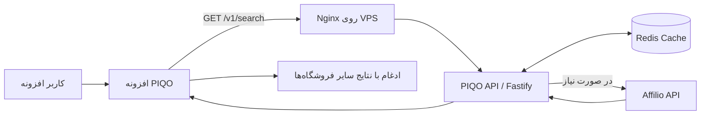

# سند تحویل فنی بک‌اند PIQO

**تاریخ تهیه:** ۲۷ سپتامبر ۲۰۲۶  
**وضعیت:** نسخه اولیه بک‌اند ساخته، تست و روی سرور اجرا شده است. اتصال افزونه به بک‌اند نیز پیاده‌سازی و آزمایش شده است.

> این سند برای تحویل پروژه به نیروی فنی آینده نوشته شده است. هیچ رمز عبور، شناسه خصوصی Affilio یا کلید خصوصی در این فایل ثبت نشده و نباید هم ثبت شود.

## ۱. خلاصه خیلی کوتاه

هدف بک‌اند این است که افزونه PIQO بتواند محصولات Affilio را بدون قرار دادن شناسه‌های محرمانه Affilio داخل مرورگر دریافت کند.

جریان کار فعلی:

1. افزونه نام محصول را به API متعلق به PIQO می‌فرستد.
2. API عبارت جست‌وجو را تمیز و استاندارد می‌کند.
3. API ابتدا Redis را برای نتیجه ذخیره‌شده بررسی می‌کند.
4. اگر لازم باشد، سرور به API عمومی Affilio درخواست می‌فرستد.
5. پاسخ Affilio به قالب داخلی PIQO تبدیل می‌شود.
6. افزونه نتایج Affilio را با نتایج فروشگاه‌های قبلی ترکیب، مرتب و تکراری‌ها را حذف می‌کند.
7. نتیجه‌های Affilio در رابط کاربری با بج «افیلیو» نمایش داده می‌شوند و لینک خرید آن‌ها لینک افیلیت است.



## ۲. مخزن‌ها و شناسه نسخه‌ها

### بک‌اند

- نام مخزن: `piqo-api`
- GitHub: `https://github.com/hossienkordipour-cmd/piqo-api`
- شاخه اصلی: `main`
- آخرین commit بررسی‌شده هنگام تهیه این سند: `17e6613 feat: scaffold PIQO affiliate API`
- مسیر نسخه محلی در زمان توسعه: `C:\Users\User\Documents\Codex\piqo-api`
- مسیر پروژه روی سرور: `/home/piqo/piqo-api`
- endpoint عمومی production: `https://api.piqoo.ir`

### افزونه

- نام مخزن: `price-finder-extension`
- GitHub: `https://github.com/hossienkordipour-cmd/price-finder-extension`
- شاخه اصلی: `main`
- commit اتصال API: `b37bd73 feat: merge Affilio API search results`
- commit بج Affilio: `5b04b6c style: add Affilio result badge`

**نکته مهم:** در زمان تهیه این سند، دو commit بالا در مخزن محلی افزونه وجود داشتند و شاخه محلی `main` دو commit از `origin/main` جلوتر بود. نیروی فنی باید ابتدا بررسی کند آیا این commitها بعداً به GitHub push شده‌اند یا نه:

```bash
git status --short --branch
git log --oneline -5
```

## ۳. فناوری‌ها

| بخش | فناوری |
|---|---|
| زبان بک‌اند | TypeScript |
| Runtime | Node.js 22 یا جدیدتر |
| وب‌فریم‌ورک | Fastify 5 |
| کش مشترک | Redis 7 |
| کانتینر | Docker و Docker Compose |
| Reverse proxy | Nginx |
| امنیت HTTP | Helmet، CORS و Rate Limit |
| تست | Node test runner با TSX |
| سیستم‌عامل سرور | Ubuntu 24.04 x86_64 |

نسخه‌های مشاهده‌شده روی سرور:

- Docker: `29.1.3`
- Docker Compose: `2.40.3`
- سرویس‌های Docker و Nginx: فعال و enabled

## ۴. ساختار مخزن بک‌اند

```text
piqo-api/
├── src/
│   ├── app.ts                    # ساخت Fastify، routeها، CORS، rate limit و خطاها
│   ├── config.ts                 # خواندن و اعتبارسنجی env
│   ├── server.ts                 # اجرای سرور و خاموش‌شدن امن
│   ├── types.ts                  # typeهای Affilio و پاسخ PIQO
│   ├── services/
│   │   ├── affilio-client.ts     # ارتباط با API عمومی Affilio
│   │   ├── cache.ts              # Redis یا کش حافظه برای توسعه
│   │   └── search-service.ts     # جست‌وجو، تبدیل داده و سیاست کش
│   └── utils/
│       └── normalize-query.ts    # استانداردسازی عبارت فارسی
├── test/
│   ├── affilio-client.test.ts
│   ├── normalize-query.test.ts
│   └── search-service.test.ts
├── .env.example                  # نمونه متغیرها، بدون مقدار محرمانه
├── docker-compose.yml
├── Dockerfile
├── package.json
└── README.md
```

## ۵. APIهای موجود

### بررسی سلامت سرویس

```http
GET /health
```

نمونه پاسخ:

```json
{
  "ok": true,
  "service": "piqo-api",
  "cache": "redis",
  "timestamp": "2026-09-27T06:22:56.955Z"
}
```

اگر `cache` برابر `redis` باشد یعنی API به Redis متصل است. در توسعه محلی بدون `REDIS_URL` مقدار آن `memory` خواهد بود.

### جست‌وجوی محصول

```http
GET /v1/search?q=عبارت جستجو
```

مثال:

```bash
curl --get --data-urlencode "q=گوشی سامسونگ A55" \
  http://127.0.0.1:3000/v1/search
```

قواعد مهم:

- عبارت جست‌وجو پس از نرمال‌سازی باید حداقل ۲ کاراکتر باشد؛ در غیر این صورت پاسخ `400 INVALID_QUERY` برمی‌گردد.
- فقط محصولات موجود، دارای قیمت معتبر و دارای `affiliate_link` پذیرفته می‌شوند.
- مرتب‌سازی درخواست Affilio روی ارزان‌ترین محصول است.
- صفحه اول و به‌صورت پیش‌فرض حداکثر ۲۰ محصول درخواست می‌شود.
- قیمت خروجی عدد صحیح و بر حسب **تومان** با کد `IRT` است.
- فیلد `url` همیشه لینک افیلیت دریافتی از Affilio است.
- پاسخ HTTP دارای `Cache-Control: private, max-age=60` است.

نمونه ساختار پاسخ:

```json
{
  "query": "گوشی سامسونگ a55",
  "results": [
    {
      "id": "affilio_...",
      "name": "گوشی سامسونگ A55",
      "store": "نام فروشگاه",
      "price": 18000000,
      "originalPrice": 20000000,
      "discount": 10,
      "currency": "IRT",
      "image": "https://...",
      "url": "https://aflo.ir/...",
      "sourceUrl": "https://...",
      "source": "affilio",
      "isAffiliate": true,
      "availability": true,
      "condition": "new",
      "code": "DKP-1"
    }
  ],
  "total": 1,
  "fetchedAt": "2026-09-27T06:13:11.415Z",
  "meta": {
    "source": "affilio",
    "cache": "miss"
  }
}
```

### معنی وضعیت کش

| مقدار | معنی |
|---|---|
| `miss` | نتیجه‌ای در کش قابل استفاده نبود و API از Affilio داده جدید گرفت. |
| `fresh` | نتیجه تازه مستقیماً از Redis تحویل شد و Affilio فراخوانی نشد. |
| `stale` | نتیجه قبلی سریع تحویل شد و تازه‌سازی در پس‌زمینه شروع شد. |

سیاست پیش‌فرض:

- نتیجه دارای محصول: ۳ دقیقه تازه (`180` ثانیه)
- پس از آن تا ۱۵ دقیقه قابل استفاده به‌صورت stale (`900` ثانیه)
- نتیجه خالی: ۱ دقیقه (`60` ثانیه)
- درخواست‌های هم‌زمان با عبارت یکسان فقط یک درخواست واقعی به Affilio ایجاد می‌کنند.

کلید Redis شامل خود عبارت جست‌وجو نیست؛ SHA-256 عبارت نرمال‌شده با الگوی زیر ذخیره می‌شود:

```text
piqo:search:v1:<sha256>
```

## ۶. نرمال‌سازی جست‌وجوی فارسی

پیش از ساخت کلید کش و ارسال جست‌وجو، موارد زیر اصلاح می‌شوند:

- `ي` و `ى` به `ی`
- `ك` به `ک`
- ارقام فارسی و عربی به انگلیسی
- نیم‌فاصله به فاصله معمولی
- حذف نشانه‌های غیرضروری
- تبدیل فاصله‌های تکراری به یک فاصله
- تبدیل حروف لاتین به lowercase

برای مثال:

```text
«  گوشي كالا ۱۵۰  »  →  «گوشی کالا 150»
```

## ۷. متغیرهای محیطی

مقادیر واقعی فقط باید در فایل `.env` روی سرور قرار بگیرند. فایل `.env` نباید commit یا برای دیگران ارسال شود.

| متغیر | کاربرد | مقدار پیش‌فرض/وضعیت |
|---|---|---|
| `NODE_ENV` | محیط اجرا | development؛ در Docker برابر production |
| `HOST` | آدرس bind برنامه | `127.0.0.1`؛ در Docker برابر `0.0.0.0` |
| `PORT` | پورت Node | `3000` |
| `AFFILIO_BASE_URL` | آدرس API Affilio | `https://public.affilio.ir` |
| `AFFILIO_PUBLISHER_UID` | شناسه ناشر Affilio | در production الزامی و محرمانه |
| `AFFILIO_MEDIA_UID` | شناسه رسانه Affilio | در production الزامی و محرمانه |
| `AFFILIO_TIMEOUT_MS` | timeout درخواست Affilio | `8000` میلی‌ثانیه |
| `AFFILIO_PAGE_SIZE` | تعداد نتیجه | `20` |
| `REDIS_URL` | آدرس Redis | در Compose: `redis://redis:6379` |
| `CACHE_FRESH_SECONDS` | زمان fresh | `180` |
| `CACHE_STALE_SECONDS` | زمان stale | `900` |
| `CACHE_EMPTY_SECONDS` | کش نتیجه خالی | `60` |
| `CORS_ORIGINS` | originهای مجاز | فعلاً `*`؛ برای production باید محدود شود |
| `API_RATE_LIMIT_MAX` | سقف درخواست هر بازه | `60` |
| `API_RATE_LIMIT_WINDOW` | بازه rate limit | `1 minute` |

در production، نبودن دو شناسه Affilio باعث می‌شود سرویس هنگام start شدن با خطا متوقف شود. همچنین مقدار stale نمی‌تواند کمتر از fresh باشد.

## ۸. نحوه ارتباط با Affilio

بک‌اند این endpoint را صدا می‌زند:

```http
GET https://public.affilio.ir/api/public/products
```

پارامترهای اصلی:

- `publisher_uid`
- `media_uid`
- `page=1`
- `page_size=20`
- `name=<query>`
- `is_available=true`
- `sort_by=cheapest`

IP خروجی ثابت VPS باید در پنل Affilio مجاز/whitelist شده باشد. در غیر این صورت جست‌وجوی واقعی ممکن است با خطای upstream مواجه شود، حتی اگر `/health` سالم باشد.

اگر Affilio پاسخ 429 بدهد، API داخلی آن را به `503 UPSTREAM_RATE_LIMITED` تبدیل می‌کند. خطاهای نامعتبر یا سایر خطاهای upstream معمولاً `502` هستند. متن خطاهای داخلی 5xx به کاربر عمومی نمایش داده نمی‌شود و پیام فارسی عمومی برمی‌گردد.

## ۹. وضعیت فعلی سرور

- Hostname مشاهده‌شده: `server3.panel01.com`
- IP عمومی: `91.247.171.166`
- سیستم‌عامل: Ubuntu 24.04 x86_64
- کاربر اجرای پروژه: `piqo`
- گروه‌های کاربر: `piqo`, `sudo`, `users` و `docker`
- مسیر پروژه: `/home/piqo/piqo-api`
- Docker و Nginx فعال هستند.
- UFW فعال است و فقط OpenSSH، پورت ۸۰ و پورت ۴۴۳ برای IPv4/IPv6 مجاز شده‌اند.
- کانتینر API فقط روی `127.0.0.1:3000` bind شده است؛ پورت Node مستقیماً از اینترنت باز نیست.
- Redis هیچ پورت عمومی ندارد و فقط داخل شبکه Docker قابل دسترسی است.
- Nginx درخواست عمومی پورت ۸۰ را به `127.0.0.1:3000` proxy می‌کند.
- فایل Nginx در `/etc/nginx/sites-available/piqo-api` ساخته و symlink آن در `sites-enabled` فعال شده است.
- کانفیگ پیش‌فرض Nginx غیرفعال شده است.
- `nginx -t` و reload موفق بوده‌اند.
- گواهی Let's Encrypt برای `api.piqoo.ir` فعال است و درخواست‌های HTTP به HTTPS redirect می‌شوند.

### وضعیت Docker Compose

دو سرویس اجرا می‌شوند:

1. `api`: برنامه Node/Fastify، با restart policy برابر `unless-stopped`
2. `redis`: تصویر `redis:7-alpine`، دارای healthcheck و ذخیره دائمی AOF

Redis حداکثر `128mb` حافظه می‌گیرد و سیاست حذف آن `allkeys-lru` است. داده Redis در volume با نام `redis-data` نگهداری می‌شود.

## ۱۰. دسترسی GitHub از سرور

برای کاربر `piqo` یک کلید SSH جداگانه ساخته شد:

```text
/home/piqo/.ssh/piqo_api_deploy
/home/piqo/.ssh/piqo_api_deploy.pub
```

کلید عمومی به‌عنوان Deploy Key مخزن `piqo-api` در GitHub اضافه شده است. گزینه **Allow write access** فعال نشده بود؛ بنابراین این کلید باید read-only باشد و سرور فقط pull/clone انجام دهد.

تست زیر با موفقیت احراز هویت کرد:

```bash
ssh -T git@github.com
```

کلید خصوصی هرگز نباید از سرور خارج یا داخل مستندات/Git ثبت شود. نمایش public key اشکال امنیتی ندارد، ولی private key کاملاً محرمانه است.

## ۱۱. راه‌اندازی اولیه بک‌اند روی یک سیستم توسعه

پیش‌نیاز: Node.js 22 یا جدیدتر.

```bash
git clone https://github.com/hossienkordipour-cmd/piqo-api.git
cd piqo-api
npm install
cp .env.example .env
```

سپس مقادیر لازم را در `.env` قرار دهید و اجرا کنید:

```bash
npm test
npm run typecheck
npm run dev
```

بدون شناسه‌های Affilio، `/health` در development کار می‌کند ولی جست‌وجو خطای `AFFILIO_NOT_CONFIGURED` می‌دهد.

## ۱۲. استقرار اولیه یا ساخت مجدد روی سرور

با کاربر `piqo`:

```bash
cd /home/piqo/piqo-api
git status --short --branch
git pull --ff-only origin main
npm test
docker compose up -d --build
docker compose ps
```

آزمایش از داخل سرور:

```bash
curl -s http://127.0.0.1:3000/health
curl -s --get --data-urlencode "q=گوشی سامسونگ A55" \
  http://127.0.0.1:3000/v1/search
```

آزمایش Nginx از خود سرور:

```bash
curl -s http://127.0.0.1/health
sudo nginx -t
systemctl is-active nginx docker
```

پیش از pull، اگر `git status` تغییر محلی نشان داد، نیروی فنی نباید آن تغییرها را بدون بررسی حذف کند.

## ۱۳. لاگ و عیب‌یابی

### مشاهده وضعیت و لاگ کانتینرها

```bash
cd /home/piqo/piqo-api
docker compose ps
docker compose logs --tail=200 api
docker compose logs --tail=100 redis
```

برای دنبال‌کردن زنده لاگ API:

```bash
docker compose logs -f api
```

### اگر سایت 502 داد

به‌ترتیب بررسی شود:

```bash
docker compose ps
curl -i http://127.0.0.1:3000/health
sudo nginx -t
sudo systemctl status nginx --no-pager
sudo tail -n 100 /var/log/nginx/error.log
```

- اگر curl پورت ۳۰۰۰ خراب است، مشکل از کانتینر/API یا `.env` است.
- اگر پورت ۳۰۰۰ سالم ولی پورت ۸۰ خراب است، مشکل از Nginx است.

### اگر `/health` سالم ولی جست‌وجو خراب بود

- وجود `AFFILIO_PUBLISHER_UID` و `AFFILIO_MEDIA_UID` در `.env` بررسی شود، بدون چاپ مقدار آن‌ها در تیکت یا چت.
- whitelist بودن IP سرور در Affilio بررسی شود.
- لاگ API برای `UPSTREAM_RATE_LIMITED`، `UPSTREAM_ERROR` یا timeout بررسی شود.
- دسترسی خروجی سرور به `public.affilio.ir` بررسی شود.

### اگر Redis مشکل داشت

```bash
docker compose ps redis
docker compose logs --tail=100 redis
docker compose exec redis redis-cli ping
```

پاسخ سالم دستور آخر باید `PONG` باشد.

## ۱۴. تست‌های انجام‌شده

تست‌های خودکار بک‌اند این موارد را پوشش می‌دهند:

- ارسال شناسه‌ها و فیلترهای درست به Affilio
- نرمال‌سازی حروف و ارقام فارسی/عربی
- حذف محصول ناموجود یا بدون لینک افیلیت
- تبدیل قیمت، قیمت اصلی و لینک خرید به قرارداد افزونه
- یکی‌کردن درخواست‌های هم‌زمان یکسان
- تحویل نتیجه fresh از کش بدون تماس دوباره با Affilio

فرمان تست:

```bash
npm test
```

آزمایش عملی production نیز انجام شد:

- `/health`: موفق، Redis فعال
- `/v1/search`: پاسخ HTTP 200
- تعداد نتیجه نمونه: ۲۰
- درخواست اول: `cache: miss`
- درخواست بعدی: `cache: fresh`
- دسترسی عمومی از پشت Nginx: موفق
- دریافت از ویندوز/افزونه: موفق

## ۱۵. اتصال افزونه به بک‌اند

فایل‌های اصلی افزونه:

- `piqo-api-client.js`: آدرس API و تبدیل پاسخ بک‌اند به مدل داخلی افزونه
- `background.js`: اجرای جست‌وجوی Affilio به‌صورت موازی با سایر فروشگاه‌ها
- `manifest.json`: مجوز دسترسی به host بک‌اند
- `sidebar/sidebar.js` و `sidebar/sidebar.css`: نمایش بج «افیلیو»

آدرس فعلی در کد افزونه:

```js
export const PIQO_API_BASE_URL = "https://api.piqoo.ir";
```

رفتار ادغام:

- Affilio هم‌زمان با دیجی‌کالا، ترب، ایمالز و سایر منابع جست‌وجو می‌شود.
- timeout جست‌وجوی سرور در افزونه ۱۲ ثانیه است.
- نتایج نامعتبر، بدون قیمت، بدون URL یا ناموجود رد می‌شوند.
- در تکراری دقیق، نتیجه‌ای که `isAffiliate: true` دارد ترجیح داده می‌شود.
- نتایج نهایی بر اساس موجودی، نو/کارکرده، قیمت و امتیاز تطابق مرتب می‌شوند.
- نتیجه Affilio با بج متنی «افیلیو» مشخص می‌شود؛ تشخیص فقط به رنگ متکی نیست.

## ۱۶. امنیت پیاده‌سازی‌شده

- شناسه‌های Affilio داخل افزونه قرار نگرفته‌اند.
- `.env` در Git ثبت نمی‌شود.
- لاگ Fastify فیلدهای Authorization، Cookie، publisher UID و media UID را redact می‌کند.
- Helmet برای headerهای امنیتی فعال است.
- rate limit پیش‌فرض ۶۰ درخواست در دقیقه فعال است.
- فقط متدهای `GET` و `OPTIONS` در CORS مجازند.
- Node با کاربر non-root داخل کانتینر اجرا می‌شود.
- Node فقط روی localhost میزبان منتشر شده است.
- Redis از اینترنت قابل دسترس نیست.
- Deploy key سرور برای GitHub read-only است.
- UFW فعال است.

## ۱۷. موارد امنیتی و عملیاتی باقی‌مانده

این موارد برای production واقعی ضروری یا مهم‌اند:

1. **محدود کردن CORS:** مقدار `CORS_ORIGINS=*` موقت است. پس از مشخص‌شدن origin نهایی افزونه/وب باید محدود شود.
2. **سخت‌سازی SSH:** ورود با کلید SSH تنظیم شود؛ سپس ورود root و password authentication در صورت امکان غیرفعال شود. قبل از این تغییر حتماً یک نشست SSH دوم برای تست باز بماند تا دسترسی قطع نشود.
4. **چرخش رمزها:** تصویر حاوی IP و اطلاعات پنل قبلاً به اشتباه در گروه عمومی فرستاده شده بود. رمزهای root و `piqo` در همان فرایند تغییر کردند، ولی رمز پنل سرویس‌دهنده و هر رمز دیگری که احتمال نمایش داشته باید دوباره بررسی/تعویض شود.
5. **بررسی لاگ ورود:** ورودهای ناشناس با `last`, `journalctl` و لاگ SSH بررسی شوند.
6. **Fail2ban یا محدودسازی SSH:** برای کاهش brute force تنظیم شود.
7. **مانیتورینگ:** uptime check، هشدار خطا، مصرف CPU/RAM/Disk و وضعیت کانتینر اضافه شود.
8. **بکاپ:** برای فایل `.env` به شکل رمزگذاری‌شده، تنظیمات Nginx و داده‌های لازم برنامه برنامه بکاپ تعریف شود. Redis در این پروژه کش است و از دست‌دادنش بحرانی نیست.
9. **CI/CD:** فعلاً استقرار دستی است. GitHub Actions یا فرایند انتشار کنترل‌شده اضافه شود.
10. **ثبت نسخه:** release/tag مشخص برای نسخه‌های production ایجاد شود تا rollback قابل اتکا باشد.
11. **احراز هویت API:** API فعلاً عمومی و بدون API key است. rate limit وجود دارد، ولی با رشد مصرف باید ضدسوءاستفاده قوی‌تری طراحی شود.
12. **نگهداری Nginx:** محتوای واقعی `/etc/nginx/sites-available/piqo-api` در Git نیست؛ باید یک نسخه تمیز و بدون secret در مخزن یا پوشه infrastructure ثبت شود.

## ۱۸. رازها و محل نگهداری آن‌ها

| مورد | محل درست | آیا باید در Git باشد؟ |
|---|---|---|
| شناسه Publisher Affilio | `.env` روی سرور/secret manager | خیر |
| شناسه Media Affilio | `.env` روی سرور/secret manager | خیر |
| private deploy key | `/home/piqo/.ssh/piqo_api_deploy` | خیر |
| public deploy key | GitHub Deploy Keys | public است؛ معمولاً نیازی به Git ندارد |
| رمز کاربر root/piqo | password manager امن | خیر |
| رمز پنل VPS | password manager امن | خیر |

هیچ‌وقت برای عیب‌یابی از دستورهایی مثل `cat .env` در اسکرین‌شات یا چت عمومی استفاده نشود. برای بررسی وجود متغیر، فقط وجود/عدم وجود آن بدون چاپ مقدار گزارش شود.

## ۱۹. کارهای پیشنهادی به ترتیب اولویت

### اولویت خیلی بالا

- محدودکردن CORS
- بررسی و سخت‌سازی SSH و رمزهای افشاشده احتمالی
- push کردن commitهای محلی افزونه در صورت تأیید نهایی

### اولویت متوسط

- افزودن مانیتورینگ و alert
- افزودن CI برای test/typecheck/build
- ذخیره کانفیگ Nginx در Git
- تعریف release و روش rollback
- اضافه‌کردن تست routeها و خطاهای 400/429/502/503
- ثبت متریک تعداد درخواست، cache hit و خطای Affilio بدون ذخیره داده محرمانه

### بهبودهای بعدی محصول

- pagination/cursor برای بیش از ۲۰ نتیجه
- پیکربندی بهتر تطبیق و حذف نتایج تکراری
- سیاست retry کنترل‌شده برای timeoutهای Affilio
- پنل یا گزارش درآمد/کلیک افیلیت در صورت فراهم‌بودن داده

## ۲۰. چک‌لیست تحویل به نیروی فنی

- [ ] دسترسی GitHub به هر دو مخزن داده شده است.
- [ ] دسترسی VPS و پنل سرویس‌دهنده به‌شکل امن تحویل شده است.
- [ ] مقادیر Affilio از مسیر امن تحویل شده‌اند، نه داخل این سند.
- [ ] نیروی فنی `npm test` و `npm run typecheck` را اجرا کرده است.
- [ ] وضعیت `git status` هر دو مخزن بررسی شده است.
- [ ] `/health` از localhost و اینترنت تست شده است.
- [ ] یک جست‌وجوی واقعی Affilio انجام و `meta.cache` بررسی شده است.
- [ ] وضعیت Docker، Redis، Nginx و UFW بررسی شده است.
- [x] دامنه `api.piqoo.ir` و HTTPS فعال‌اند.
- [ ] CORS تعیین تکلیف شده است.
- [ ] commitهای محلی افزونه push یا مستند شده‌اند.
- [ ] کانفیگ واقعی Nginx و محل secretها تحویل شده است.

## ۲۱. واژه‌نامه ساده

- **API:** مسیری که افزونه از طریق آن با سرور صحبت می‌کند.
- **Backend:** بخشی که روی سرور اجرا می‌شود و کاربر مستقیماً آن را نمی‌بیند.
- **Redis/Cache:** حافظه موقت برای سریع‌ترشدن پاسخ و کاهش درخواست به Affilio.
- **Docker:** روش بسته‌بندی و اجرای یکسان برنامه روی سرور.
- **Nginx:** دروازه ورودی وب که درخواست عمومی را به برنامه داخلی می‌رساند.
- **CORS:** قانونی که مشخص می‌کند چه سایت/افزونه‌ای اجازه تماس با API را دارد.
- **Rate limit:** محدودیت تعداد درخواست برای جلوگیری از مصرف بیش از حد یا حمله.
- **Deploy key:** کلید مخصوصی که فقط به سرور اجازه خواندن یک مخزن GitHub را می‌دهد.
- **HTTPS/TLS:** ارتباط رمزنگاری‌شده بین افزونه و سرور.
- **Reverse proxy:** نقش Nginx در دریافت درخواست عمومی و فرستادن آن به Node روی پورت داخلی.

---

### جمع‌بندی وضعیت تحویل

MVP بک‌اند عملیاتی است: Affilio پاسخ واقعی می‌دهد، Redis کار می‌کند، Nginx و Docker فعال‌اند، endpoint امن `https://api.piqoo.ir` در دسترس است و افزونه می‌تواند نتایج را دریافت و با بج Affilio نمایش دهد. مهم‌ترین بدهی‌های فعلی production، CORS باز، نبود مانیتورینگ و استقرار دستی هستند.
